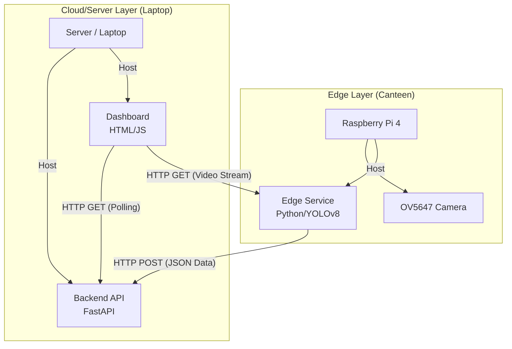
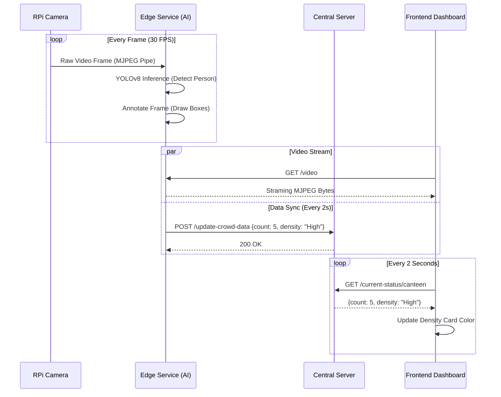
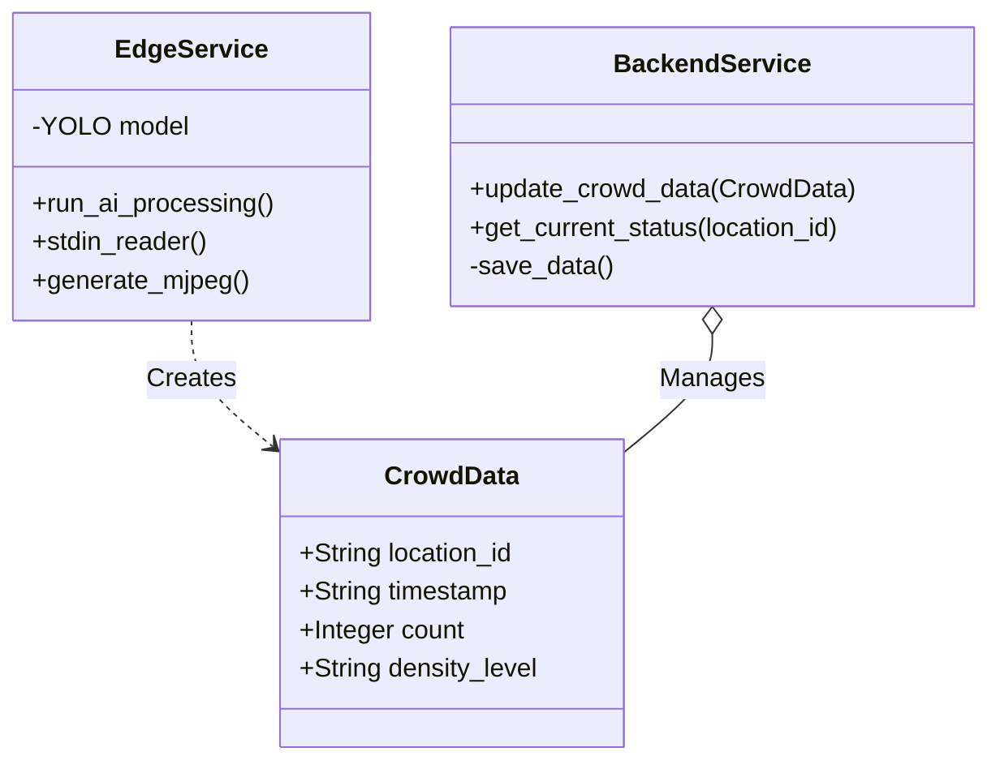

# Design & Technical Documentation: Campus CrowdPlus

## 1. Design Architecture
The system follows a **Hybrid Edge-Cloud Architecture**, designed to minimize bandwidth usage while providing real-time visual verification.

### System Components & I/O Flow

| Component | Description | Input | Output |
|-----------|-------------|-------|--------|
| **1. Edge Node (RPi 4)** | The "Smart Camera" unit deployed at the physical location (e.g., Canteen). | **Process:** Optical Video Feed (via OV5647 Sensor).<br>**Signal:** Raw Camera Data via CSI Loop. | **Data:** JSON payload (Count, Density Level) sent via HTTP POST.<br>**Visual:** MJPEG Video Stream (Annotated) via HTTP (Port 5000). |
| **2. Backend Service (Laptop/Cloud)** | The central aggregator that maintains the state of the campus. | **Data:** JSON Payload from Edge Node.<br>**Requests:** HTTP GET requests from Frontend. | **API:** JSON Status Response (Current metrics).<br>**Logs:** Activity history. |
| **3. Frontend Dashboard** | The user-facing interface for monitoring. | **Data:** JSON updates from Backend.<br>**Stream:** Direct video feed from Edge Node URL. | **Visual:** Dynamic Density Cards, Live Video Feed, Trend Indicators. |

---

## 2. Prototype & Dimensions

### Physical Specifications (Hardware)
The physical prototype consists of a Raspberry Pi 4 Model B encased in a protective shell, connected to a camera module mounted for optimal field-of-view (FOV).

*   **Dimensions (Main Unit):** 88mm (L) x 58mm (W) x 20mm (H)
*   **Weight:** Approx. 120g (Board + Case + Fans)
*   **Volume:** ~102 cm³
*   **Space Requirement:** Requires a 10cm x 10cm mounting surface near a power outlet.
*   **Mounting Height:** Recommended 2.5m - 3.0m from ground for optimal crowd counting.

### Conceptual Engineering Drawings

#### Top View (Plan)
*Depicts the device mounted on a wall, showing the horizontal Field of View (FOV) covering the canteen area.*
```text
      [ Wall ]
         |
      [RPi Unit]
         /  \
       /      \  ~62° Horizontal FOV
     /          \
   [   Crowd Area   ]
```

#### Side View (Elevation)
*Depicts the camera tilt angle to capture heads/shoulders while minimizing occlusion.*
```text
      [Ceiling]
          |
      [RPi Unit]--\
          |        \  Down-tilt ~45°
          |         \
          |          \
      [Worker]     [Floor]
```

---

## 3. Application Oriented Design (UML)

### A. Use Case Diagram
*   **Actors:** Security Admin, Campus Manager, Setup Technician.
*   **Use Cases:**
    *   **Monitor Density:** View real-time count of students.
    *   **View Live Feed:** Verify automated counts visually.
    *   **System Alert:** Receive visual flags when density is "High".
    *   **Configure Node:** Set camera source or backend IP.

### B. Deployment Diagram


### C. Sequence Diagram (Data Flow)


### D. Class Diagram (Software Structure)


---

## 4. Bill of Materials (BOM)

### Hardware Components

| Component | Quantity | Description | Estimated Cost |
|-----------|:--------:|-------------|----------------|
| **Raspberry Pi 4 Model B** | 1 | 4GB RAM Single Board Computer. Core processing unit. | ~$55.00 |
| **Camera Module V1 (OV5647)** | 1 | 5MP CSI Camera Module. connects via ribbon cable. | ~$15.00 |
| **Micro SD Card** | 1 | 32GB Class 10 A1 (Sandisk/Samsung). Storage for OS & Logs. | ~$8.00 |
| **Power Supply** | 1 | USB-C 5.1V 3A Power Adapter (Official). | ~$10.00 |
| **Camera Ribbon Cable** | 1 | 15cm CSI Flex Cable (Usually included with cam). | Included |
| **Mounting Case** | 1 | Acrylic or ABS case with fan mount. | ~$10.00 |
| **Host Laptop** | 1 | Windows 10/11 Laptop for Backend/Frontend hosting. | N/A (Existing) |

### Software Components

| Component | Version | Description | License |
|-----------|:-------:|-------------|---------|
| **Operating System** | Debian 12 | Raspberry Pi OS (Bookworm/Trixie) - 64-bit Lite | Open Source (GPL) |
| **Python** | 3.11+ | Implementation Language | PSF License |
| **YOLOv8** | 8.0 (Nano) | Object Detection Model (`ultralytics`). | AGPL-3.0 |
| **OpenCV** | 4.x | Computer Vision Library (Headless). | Apache 2.0 |
| **FastAPI** | 0.95+ | High-performance Web Framework for API. | MIT |
| **rpicam-apps** | Latest | Hardware-accelerated camera capturing tools. | BSD-2-Clause |

---

## 5. Input/Output Specifications

### Edge Service (RPi)
*   **Input:** `stdin` pipe receiving raw MJPEG stream at 640x480 resolution.
*   **Internal Processing:** Resizing to 640x640 (YOLO input), Non-Max Suppression (NMS) for box deduplication.
*   **Output (Data):**
    ```json
    {
      "location_id": "canteen",
      "timestamp": "2026-01-15T13:30:00",
      "count": 12,
      "density_level": "High",
      "trend": "Stable"
    }
    ```
*   **Output (Stream):** `multipart/x-mixed-replace` MIME type stream of JPEG images.

### Backend Service
*   **Input:** JSON payloads via HTTP POST.
*   **Storage:** Ephemeral In-Memory dictionary + `data/crowd_data.json` persistence.
*   **Output:** JSON State representation.
